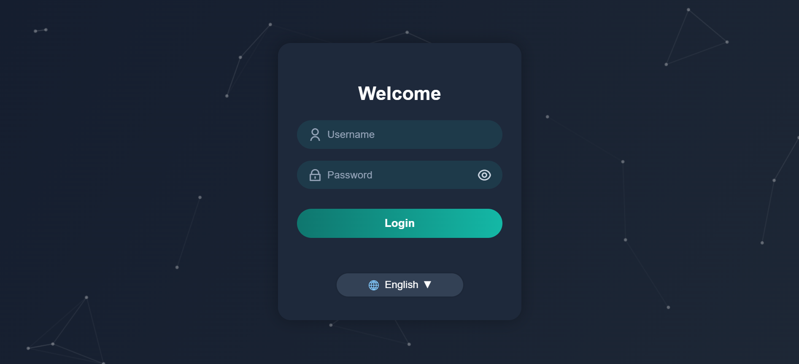

# 🌐 Modern Login Page

A beautiful and modern login form with an animated background and RTL (right-to-left) language support. Built with HTML, CSS, and JavaScript — no frameworks required.

## ✨ Features

- 🎨 Animated gradient background with particles effect
- 🌍 Language switcher (English / فارسی)
- 🔒 Show/Hide password toggle button
- 💡 Clean and modern UI
- 📱 Fully responsive and RTL-compatible

## 🚀 Live Demo

> You can host this on GitHub Pages or any static web hosting.

## 📁 Folder Structure

```
modern-login-page/
├── index.html
├── preview.png
├── README.md
```

## 📸 Preview



## 🧾 License

MIT
